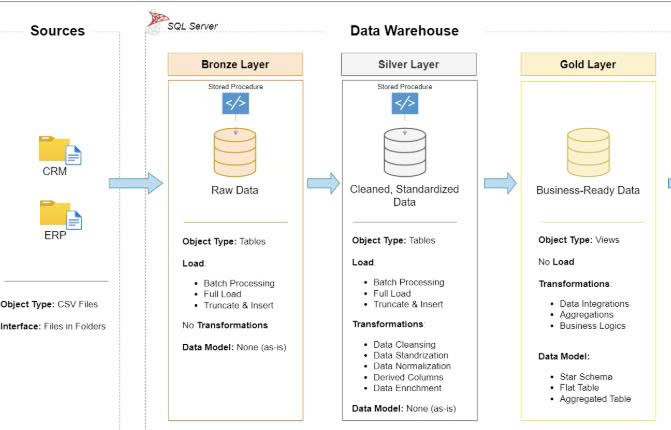

#  Data Warehouse & Analytics Project
*A Modern SQL Server Data Warehouse using Medallion Architecture*

---

##  Project Overview
This project demonstrates an **end-to-end Data Warehouse and Analytics solution**, from raw data ingestion to business-ready analytical insights.  
It is designed as a **portfolio project** to showcase hands-on experience in:

- Data Engineering  
- SQL Development  
- ETL Pipeline Design  
- Data Modeling (Star Schema)  
- Data Analytics & Reporting  

The solution is built on **SQL Server** and follows **Medallion Architecture (Bronze → Silver → Gold)**.

---

##  Data Architecture – Medallion Architecture 

###  Bronze Layer – Raw Data
**Purpose:** Store raw data exactly as received from source systems.

- Data Sources:
  - ERP System (CSV files)
  - CRM System (CSV files)
- No transformations applied
- Ensures traceability and reprocessing capability

---

###  Silver Layer – Cleaned & Transformed Data
**Purpose:** Improve data quality through cleansing, standardization, and normalization.

####  Data Quality Issues & Transformations

##### 1. `crm_cust_info`
**Issues**
- Duplicate customer IDs
- Unexpected leading/trailing spaces
- Inconsistent values in `gender` and `cst_marital_status`

**Transformations**
- Removed duplicates
- Trimmed whitespace
- Standardized gender values
- Standardized marital status values

---

##### 2. `crm_prd_info`
**Issues**
- Embedded information inside `prd_key`
- Invalid date ranges (`start_date > end_date`)

**Transformations**
- Extracted:
  - `cat_id`
  - `prd_key`
- Fixed or filtered invalid date records
---

##### 3. `crm_sales_details`
**Issues**
- Invalid product keys
- Invalid or malformed date values
- Business rule violations

**Transformations**
- Transformed `sls_prd_key`
- Safely cast date columns:
  - `order_date`
  - `ship_date`
  - `due_date`
- Validated date logic:
  - `order_date <= ship_date`
  - `order_date <= due_date`
- Enforced business rule:
sale_amount = price * quantity
---
##### 4. `erp_cust_az12`
**Issues**
- Customer key embedded in `cid`
- Invalid birth dates
- Inconsistent gender values

**Transformations**
- Extracted `cust_key` from `cid`
- Validated birth dates:
- `bdate < '1920-01-01'`
- `bdate > GETDATE()`
- Standardized gender values
---
##### 5. `erp_loc_a101`
**Issues**
- Customer key embedded in `cid`
- Inconsistent country values
**Transformations**
- Extracted `cust_key`
- Standardized country names
- Ensured country value consistency
---
##### 6. `erp_px_cat_g1v2`
**Transformations**
- Cleaned and standardized product category reference data
- Prepared for dimensional modeling
---

###  Gold Layer – Business-Ready Data
**Purpose:** Provide analytics-ready data modeled using a **Star Schema**.

####  Data Model
- **Fact Table**
- `fact_sales`
- **Dimension Tables**
- `dim_customers`
- `dim_products`
---
#### Integration Challenges & Solutions
##### Customer Gender Conflict
Both systems provide gender information:
- `crm_cust_info.cst_gdr`
- `erp_cust_az12.gen`
**Solution**
- CRM is the primary source
- ERP is used as a fallback
sql
COALESCE(cst_gdr, gen)
## Future Work – BI & Advanced Analytics

In the next phase of this project, the data warehouse will be extended with **Power BI** to enable interactive dashboards and deeper business insights.

###  Power BI Integration
- Connect Power BI directly to the **Gold Layer** in SQL Server
- Use the **star schema model** for optimized BI performance
- Implement semantic models with measures and KPIs using DAX

###  Planned Analytics Use Cases

#### Customer Behavior
- Customer segmentation by:
  - Country
  - Gender
  - Marital status
- Customer lifetime value (CLV)
- Purchase frequency and retention analysis

####  Product Performance
- Top & bottom performing products
- Revenue and quantity sold by:
  - Product
  - Category
- Product contribution to total sales

#### Sales Trends
- Sales trends over time (daily, monthly, yearly)
- Seasonality analysis
- Comparison between order date, ship date, and due date performance

###  Value Proposition
By integrating **Power BI**, this data warehouse will evolve from a reporting database into a **decision-support system**, enabling:
- Self-service analytics
- Interactive dashboards
- Data-driven business decisions

---
